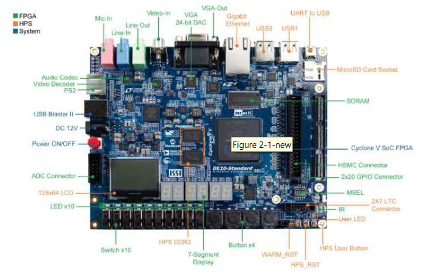

**Joeseph Sande's - Software Engineer Resume**

* [Joeseph Sande's Resume](https://github.com/JSande2021/Wakeup9000/blob/main/JoesephSandeSoftwareEngineerResume.pdf)

**Biography**

* [Biography](https://github.com/JSande2021/StartHere/blob/main/README.md)

**Contact Information**

- Email = joesephsande@gmail.com
- LinkedIn = https://www.linkedin.com/in/joeseph-sande-2a2974224/

**Wakeup9000**

First embedded system C-based program that utilizes FPGA technology integrated with an ARM processor and incorporates VHDL language standards.

**Final Release**
[Final Release Phase](https://www.loom.com/share/a7e54c53bf8d4545b72b07a3edc1d437)

**Testing Phase**
[Testing Phase Release](https://www.loom.com/share/f5a857eae48d49fdb999e18a4e3816b4)

**Technology Concepts Utilized**

- FPGA
- C modularization between application logic and hardware logic
- Binary-coded decimal conversion for time display

* [Project Proposal](https://github.com/JSande2021/Wakeup9000/blob/main/ProjectProposal.pdf)

* [Design Requirements](https://github.com/JSande2021/Wakeup9000/blob/main/DesignRequirements.pdf)

* [Architecture Design](https://github.com/JSande2021/Wakeup9000/blob/main/ArchitectureDesign.pdf)

* [Main Clock Flowchart Diagram](https://github.com/JSande2021/Wakeup9000/blob/main/MainClockFlowchart.png)

* [Alarm Configuration Flowchart Diagram](https://github.com/JSande2021/Wakeup9000/blob/main/alarmconfigflowchart.png)

* [Main Clock Configuration Flowchart Diagram](https://github.com/JSande2021/Wakeup9000/blob/main/checkconfigflowchart.png)

* [Alarm Status Flowchart Diagram](https://github.com/JSande2021/Wakeup9000/blob/main/checkalarmstatusflowchart.png)

**Challenges overcome during project!**

- Ramp up technical knowledge of general embedded systems development.
- Ramp up technical knowledge of complex C programming.
- Ramp up technical knowledge of BCD decoding.
- Set up a development environment for FPGA programming.
- Ramp up technical knowledge of what components are and what they are utilized for on the FPGA board.
- Ramp up technical knowledge on FPGA technology.
- Ramp up technical knowledge of ARM development.
- Ramp up technical knowledge on VHDL language standards.
- Ramp up technical knowledge of module-based programming for C programs.
- Ramp up technical knowledge of GO Lang for proof of concept.

